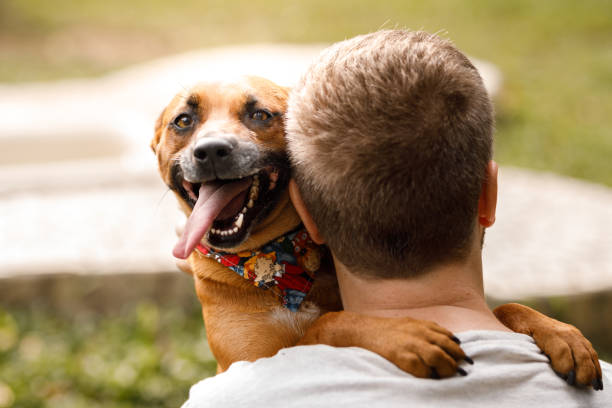

# Pet Adoption Website

Welcome to the Pet Adoption website! This website is dedicated to finding loving homes for pets in need. Our mission is to make the adoption process as seamless and joyful as possible. Here, you can browse through our selection of adorable pets waiting for a forever home and find your perfect companion today.

## Table of Contents

- [About](#about)
- [Adopt](#adopt)
- [Contact](#contact)

## Demo

To see the website in action, you can visit the [Pet Adoption Demo](https://raj-pet-shop-landing-page.netlify.app/) here.

## Screenshots

## About Us

We are a passionate team of animal lovers committed to finding loving homes for pets in need. Our goal is to bring happiness and joy to both pets and adopters by making the adoption process as smooth as possible.

## Adopt a Pet

Browse through our adorable pets waiting for a forever home. Each pet has a unique story and is ready to become your loyal companion. Don't miss the chance to change a life and make a furry friend happy.

## Contact Us

If you have any questions or want to know more about our adoption process, please feel free to get in touch with us. We are here to assist you and ensure a smooth adoption experience.

## How to Run Locally

1. Clone the repository: `git clone https://github.com/Rj1221/pet-adoption.git`
2. Open the `index.html` file in your preferred web browser.
3. Explore the website and find your perfect pet!

## Technologies Used

- HTML5
- CSS3
- Bootstrap 5.0.0-alpha1
- JavaScript (jQuery)

## License

This project is licensed under the [MIT License](LICENSE).

&copy; 2023 Pet Adoption. All rights reserved.

---
